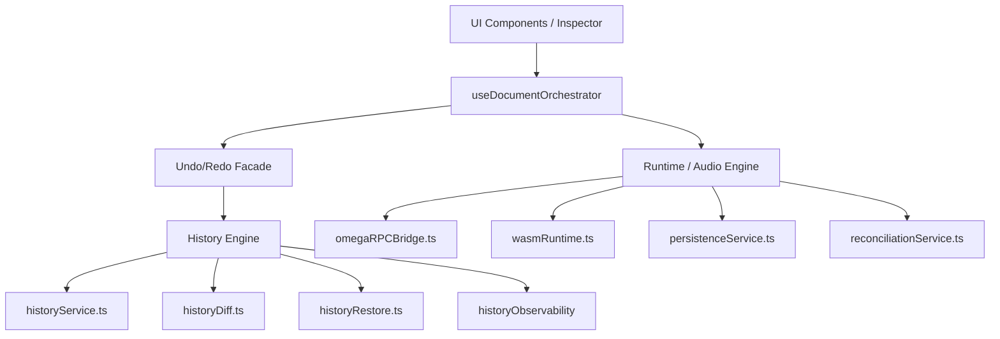

# ADR-037: History Engine vs. Undo/Redo Architecture

## Status
PROPOSED

## Context
The OMEGA Manifest Editor currently maintains a local `history` stack (past/future) in its state for basic undo/redo functionality. With the introduction of the Phase 21 **History Engine**, there is a risk of duplication and semantic confusion between these two systems. We need to define a clear relationship and hierarchy to ensure architectural integrity.

## Decision
We will establish a layered architecture where the **History Engine** is the canonical source of truth for all historical revisions, while the **Undo/Redo** system acts as a high-frequency UX facade.

### 1. Responsibility Matrix

| Aspect | Undo/Redo | History Engine | Integration Goal |
| :--- | :--- | :--- | :--- |
| **Purpose** | Revert/Redo recent user actions (UX). | Record and explain system evolution (Audit). | Complementary Layers |
| **Horizon** | Short-term (Session-based). | Long-term (Persistent/Versioned). | History as Backend |
| **Data** | Lightweight snapshots or commands. | Full revisions, Lineage, Semantic Diffs. | Shared source of truth |
| **Validation** | Revert to local state. | Strict Restore via Blueprint Gatekeeping. | History is more rigorous |
| **Observability** | Minimal / Transient. | Mandatory and Traceable (Correlation IDs). | History is instrumented |

### 2. Layered Map

### 3. Structural Rules
1. **No Duplication**: The History Engine is the only component that manages revision lineage and durable storage of past states.
2. **Undo/Redo as Wrapper**: The undo/redo logic in the orchestrator should eventually delegate to the History Engine or operate on a subset of history checkpoints.
3. **Semantic Boundary**: 
    - `useUndoRedo` (if exists) or Undo actions serve the user's immediate editing intent.
    - `History Engine` serves audit trails, debugging, recovery, and deep time-travel.
4. **Validation Gate**: Restoring a historical revision MUST always pass through `historyRestore.ts` validation, whereas an `undo` operation may be optimized for speed if the state was recently validated.

## Consequences
- Clear separation between editing UX and system auditability.
- Avoids state drift between two parallel history stacks.
- Provides a path to migrate the legacy undo/redo stack to the new engine backend.
- Simplifies testing and observability of historical events.

## Done When
- Architectural document is published.
- Relationship between `useDocumentOrchestrator` undo logic and `historyService` is clarified.
- All Phase 21 components follow this layered approach.
