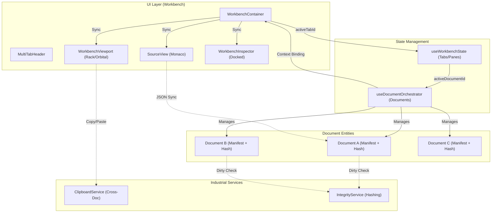

# OMEGA Multi-Document Architecture (Phase 7.1)

## Key Components

1. **Workbench Tabs (UI)**: Represent a "view" of a document. Multiple tabs can point to the same `documentId`.
2. **Document Orchestrator (Orchestration)**: Central registry of all open documents. Maintains a dictionary of independent states.
3. **Active Document Sync**: When a tab is focused, the orchestrator updates `activeDocumentId`. All global-context components (Inspector, Viewports) derive their manifest from this active ID.
4. **Clipboard Service**: External service that survives document switching, allowing entities to be moved between different manifests with ID regeneration.
