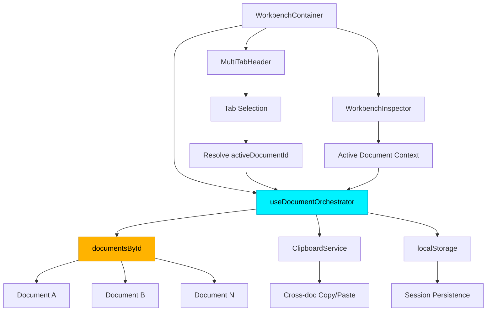

# OMEGA PHASE 7.1 — CIERRE Y DOCUMENTACIÓN FINAL

**Estado alcanzado:** `SYS_READY_FOR_PHASE_8`  
**Próximo hito:** Phase 8 (Undo/Redo Engine) en conversación nueva

---

## ANTES DE CERRAR ESTA CONVERSACIÓN

Para que Phase 8 arranque limpio en una conversación nueva, necesito que completes este checklist de documentación y consolidación:

### 1. BUNDLE TÉCNICO ACTUALIZADO
Genera un snapshot completo del código actual:

```bash
# Crear bundle con timestamp actual
node scripts/generate-bundle.js
# Salida esperada: project_bundle_YYYYMMDDHHMM.jsonl
```

**Validar que incluya:**
- ✅ `useDocumentOrchestrator.ts` refactorizado con reducer dinámico
- ✅ `WorkbenchContainer.tsx` con binding tab → documentId
- ✅ `ClipboardService.ts` cross-document
- ✅ Eliminación confirmada de `useManifestState.ts`
- ✅ `beforeunload` agregado multi-documento
- ✅ Persistencia de sesión en localStorage

### 2. WALKTHROUGH.MD — REGISTRO DE FASE
Actualiza `walkthrough.md` con sección dedicada a Phase 7.1:

**Título:** `## Phase 7.1: Multi-Documento Real (CLOSED & STABILIZED)`

**Contenido mínimo:**
```markdown
### Fecha de cierre
11 Mayo 2026

### Logros principales
- Orquestador dinámico con `documentsById: Record<string, DocumentState>`
- Binding estricto tab → documentId
- Inspector inteligente siguiendo documento activo
- Dirty state aislado por documento
- beforeunload agregado (escanea todos los documentos)
- ClipboardService cross-document con regeneración de IDs
- Persistencia de sesión multi-documento en localStorage
- Absorción de useManifestState (eliminado)

### Smoke tests pasados
✅ Abrir 2+ manifiestos simultáneos
✅ Dirty badge aislado por documento
✅ Inspector tracking documento activo correcto
✅ beforeunload con múltiples documentos dirty
✅ Session restore tras reload
✅ Copy/paste cross-document funcional
✅ Zero regresiones vs Phase 7.0

### Arquitectura de referencia
- Monaco multi-model pattern (un editor, múltiples modelos)
- VS Code workspace (múltiples archivos en editor groups)
- Document-centric state isolation

### Estado de salida
SYS_READY_FOR_PHASE_8
```

### 3. ARCHITECTURE MAP ACTUALIZADO
Actualiza `map.md` o crea `architecture_7_1.md`:

**Diagrama Mermaid del flujo multi-documento:**


**Descripción textual:**
- Cada documento es una entidad aislada con manifest + contract + isDirty + hash
- Las tabs tienen `payload.documentId` que enlaza con el documento
- Inspector y vistas derivan su contexto del documento activo
- beforeunload escanea `Object.values(documentsById).some(d => d.isDirty)`

### 4. CHANGELOG FORMAL
Añade entrada en `CHANGELOG.md`:

```markdown
## [Phase 7.1] - 2026-05-11

### Added
- Multi-document orchestrator with dynamic `documentsById` state
- Cross-document clipboard service with ID regeneration
- Session persistence for multiple open documents
- Bulk upload support (multiple .acemm files → multiple documents)
- Document name display in tab headers (from manifest metadata)

### Changed
- Tabs now strictly bound to `documentId` via payload
- Inspector tracks active document instead of global state
- `beforeunload` now aggregates dirty state across all documents
- File loading creates NEW document instead of replacing current

### Removed
- `useManifestState.ts` (logic absorbed into orchestrator)
- Global single-document assumptions throughout codebase

### Fixed
- Dirty state isolation per document
- Context switching between documents without state contamination
- Memory leaks when closing documents (proper cleanup)
```

### 5. EXPORT FINAL DE ESTADO
Genera estos artefactos para Phase 8:

**A. Estado del orquestador (JSON)**
```typescript
// Ejecuta en consola del navegador:
localStorage.getItem('omega-workspace-state')
// Copia el output a: output/workspace_state_snapshot.json
```

**B. TypeScript interfaces exportadas**
Crea `output/phase_7_1_contracts.ts`:
```typescript
// Extrae las interfaces públicas de:
// - DocumentState
// - DocumentOrchestrator
// - ClipboardEntry
// Y sus tipos relacionados
```

**C. Smoke test results**
Crea `output/phase_7_1_smoke_tests.md` con:
- Screenshots de múltiples documentos abiertos
- Evidencia de dirty badges aislados
- Captura de beforeunload con múltiples docs
- Session restore funcionando

### 6. VERIFICATION FINAL
Antes de cerrar, ejecuta:

```bash
# TypeScript clean
npx tsc --noEmit

# Linting
npm run lint --quiet

# Build check
npm run build

# Todos deben pasar con ZERO errores
```

### 7. COMMIT ATÓMICO
Crea un commit de cierre de fase:

```bash
git add .
git commit -m "feat(phase-7.1): Multi-document workspace [CLOSED & STABILIZED]

- Dynamic document orchestrator with isolated state
- Tab-to-document binding with active context tracking
- Cross-document clipboard with ID regeneration
- Session persistence in localStorage
- beforeunload aggregation across documents
- Removed useManifestState redundancy

Smoke tests: ✅ All passed
State: SYS_READY_FOR_PHASE_8
Ref: OMEGA-7.1-EXEC-ORDER"
```

---

## ENTREGABLES PARA PHASE 8

Una vez completado el checklist, prepara estos artefactos para la nueva conversación:

### Para el prompt de Phase 8:
1. **Bundle actualizado** (`project_bundle_YYYYMMDDHHMM.jsonl`)
2. **Architecture snapshot** (diagrama + descripción textual)
3. **Contracts TypeScript** (interfaces públicas del orchestrator)
4. **Workspace state JSON** (estado real del localStorage)
5. **Este checklist completado** (para confirmar base limpia)

### Frase de inicio para Phase 8:
```
Adjunto bundle actualizado de Phase 7.1 CLOSED & STABILIZED.
Estado certificado: SYS_READY_FOR_PHASE_8.

El orquestador multi-documento está operativo con:
- documentsById dinámico
- Dirty state aislado por documento
- Session persistence funcional
- Zero dependencias legacy

Iniciamos Phase 8: Advanced History & Undo/Redo Engine.
Cada documento está listo para recibir su propia pila de historial.

[ADJUNTAR: project_bundle_YYYYMMDDHHMM.jsonl]
```

---

## ORDEN DE EJECUCIÓN (AHORA)

1. ✅ Generar bundle actualizado
2. ✅ Actualizar walkthrough.md con Phase 7.1
3. ✅ Actualizar/crear architecture map
4. ✅ Añadir entrada en CHANGELOG.md
5. ✅ Exportar workspace state snapshot
6. ✅ Crear contracts TypeScript
7. ✅ Documentar smoke tests
8. ✅ Verificación técnica (tsc + lint + build)
9. ✅ Commit atómico de cierre
10. ✅ Preparar artefactos para Phase 8

**SOLO DESPUÉS** de completar estos 10 pasos, cierra esta conversación.

---

**Estado actual:** Phase 7.1 implementada, pendiente de documentación  
**Estado objetivo:** Phase 7.1 DOCUMENTED & ARCHIVED  
**Próxima acción:** Ejecutar checklist completo
