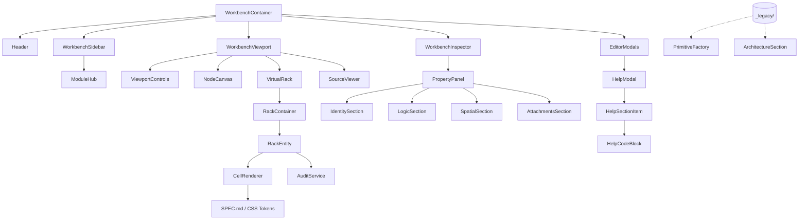

# OMEGA Architecture Map (Era 7.2.3)

> **Status**: INDUSTRIALIZED (SYS_READY)
> **Standard**: OMEGA-ABI-7.2.3-INDUSTRIAL

## 1. Relational Map (Mermaid)

## 2. Directory Structure & Responsibilities

### 2.1 Core Orchestration
- **WorkbenchContainer**: The main event loop. Orchestrates state between manifest, viewport, and inspector.
- **VirtualRack**: High-fidelity 1.5x viewport. Uses CSS Grid for layout and CellRenderer for entities.

### 2.2 Rendering Engine (Era 7.2.3)
- **CellRenderer**: Stateless HTML generator. Guarantees 1:1 parity with the WASM engine rendering path.
- **omega-ui-core**: Centralized styles and tokens. The "Law of the Rack".

### 2.3 Inspector (New Structure)
- **PropertyPanel**: Unified inspector. Adapts to global module or specific entity selection.
- **LogicSection**: Unified bindings, technical protocols, and registry roles.
- **SpatialSection**: Position management using the new **ContainerSelector**.
- **ContainerSelector**: (New) Replaces legacy Arch selectors. Direct mapping to layout containers.

### 2.4 Legacy Archive
- **_legacy/**: Contains obsolete Era 6 components. Archiving these reduces workspace noise and prevents usage of deprecated patterns.

## 3. Data Integrity Flow
1. **Developer** modifies properties in the **PropertyPanel**.
2. **ContainerSelector** maps the entity to an architectural frame.
3. **CellRenderer** generates the pixel-perfect HTML string.
4. **VirtualRack** injects the HTML into the chasis.
5. **Watchdog** (optional) syncs changes back to the local file system.
