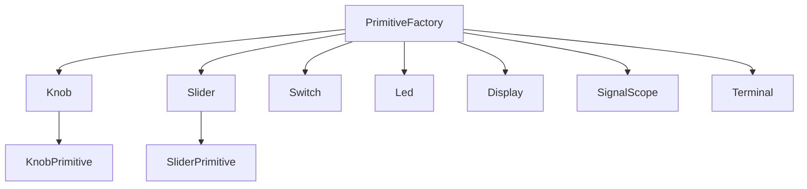

# OMEGA Primitives Architecture (Era 7.2.3)

> **Standard**: OMEGA-PRIM-7.2.3
> **Principles**: Stateless, Parity, Pixel-Perfect

## 1. Relational Map

## 2. Component Standards
All primitives must be **Stateless**. They receive `value` and `onValueChange` and do not manage their own internal signal state.

### 2.1 Visual Feedback
- **Knob**: Rotational animation (270deg). Supports custom assets (frames/orientation).
- **SignalScope**: Canvas-based real-time visualizer for bipolar signals (-1..1).
- **Terminal**: Monospace buffer for system logs and telemetry.

## 3. Parity with C++ Engine
Any change to the visual geometry of these components must be coordinated with the `CellRenderer` in `omega-ui-core` to ensure 100% parity with the host application.
