# OMEGA UI Component Architecture

> **Directory**: `src/components/ui`
> **Status**: INDUSTRIALIZED (Era 7.2.3 Standards)

## 1. Architectural Map (Mermaid)

```mermaid
graph TD
    %% Main Entry Points
    AS[AudioShowcase] --> UAP[useAudioPlayer Hook]
    AS --> AP[AudioPlaylist]
    AS --> AV[AudioVisualizer]
    AS --> AC[AudioControls]
    AS --> ATI[AudioTrackInfo]
    AS --> AMG[AudioMetadataGrid]

    IG[ImageGallery] --> GTG[GalleryThumbnailGrid]
    IG --> GL[GalleryLightbox]
    
    CF[ContactForm] --> UCF[useContactForm Hook]
    CF --> CS[ContactSuccess]
    CF --> CFi[ContactField]
    CF --> MC[MathChallenge]
    
    IC[InstrumentCard] --> CI[CardImage]
    IC --> CH[CardHeader]
    IC --> CSp[CardSpecs]
    IC --> CFo[CardFooter]
    
    %% Common Components
    GP[GlassPanel]
    BTN[Button]
    SP[SignalPath]
    SM[SpecsMatrix]
    RS[RenderShowcase]
    
    %% Sub-directories
    subgraph Audio[audio/]
        UAP
        AP
        AV
        AC
        ATI
        AMG
    end

    subgraph Gallery[gallery/]
        GTG
        GL
    end
    
    subgraph Contact[contact/]
        UCF
        CS
        CFi
        MC
    end
    
    subgraph Card[card/]
        CI
        CH
        CSp
        CFo
    end

    %% Global Utilities
    CN[cn / Tailwind]
    AS -.-> CN
    IG -.-> CN
    CF -.-> CN
    IC -.-> CN
```

## 2. Component Responsibility & Modularization

### 2.1 Audio Module (`/audio`)
- **AudioShowcase**: Main orchestrator for instrument audio demonstrations.
- **useAudioPlayer**: Centralized logic for playback and state.
- **AudioPlaylist / Visualizer / Controls / TrackInfo / MetadataGrid**: Specialized UI units.

### 2.2 Gallery Module (`/gallery`)
- **ImageGallery**: Cinematic chasis for visual interface modules.
- **GalleryThumbnailGrid**: Responsive grid of snapshots.
- **GalleryLightbox**: 3D carousel and fullscreen overlay engine.

### 2.3 Contact Module (`/contact`)
- **ContactForm**: Entry point for professional inquiries.
- **useContactForm**: Logic for submission, validation, and math challenge.
- **ContactSuccess / ContactField / MathChallenge**: Form infrastructure components.

### 2.4 Card Module (`/card`)
- **InstrumentCard**: High-fidelity module preview.
- **CardImage / Header / Specs / Footer**: Atomic card sections for easier maintenance.

### 2.5 Core Infrastructure
- **GlassPanel**: The fundamental structural primitive with Gaussian blur.
- **Button**: Standardized industrial interaction point.
- **SignalPath**: Visual representation of signal routing.
- **SpecsMatrix**: Technical data grid for specifications.
- **RenderShowcase**: Dynamic display of 3D instrument renders.

## 3. Implementation Standards
- **Framer Motion**: Standard for cinematic transitions and feedback.
- **Lucide-React**: Unified iconography system.
- **Next-Intl**: Mandatory internationalization for all user-facing strings.
- **Tailwind CSS**: Managed via `cn()` utility for dynamic styling.
