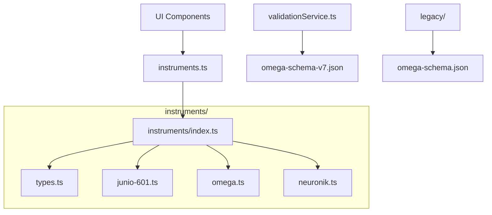

# OMEGA Data Architecture

> **Directory**: `src/data`
> **Status**: INDUSTRIALIZED (Era 7.2.3 Standards)

## 1. Architectural Map (Mermaid)

## 2. Data Structure & Modularization

### 2.1 Instrument Catalog (`/instruments`)
- **types.ts**: Centralized TypeScript interfaces for strict data governance.
- **junio-601.ts**: Specific metadata and specs for the JUNiO 601 Analog Synth.
- **omega.ts**: Specifications and modular routing for the OMEGA system.
- **neuronik.ts**: Hybrid neural engine data, including extensive image galleries.
- **index.ts**: Consolidation point that exports the unified `instruments` array.

### 2.2 Validation Schemas
- **omega-schema-v7.json**: The current industrial standard for OMEGA Era 7.2.3 validation. Used by `validationService.ts`.
- **omega-schema.json**: [LEGACY] Obsolete Era 6 schema. Retained for historical reference only.

## 3. Governance Rules
- **Schema Parity**: Any changes to instrument data structures MUST be reflected in `types.ts` and validated against `omega-schema-v7.json`.
- **Isolation**: New instruments MUST be created as individual files in the `/instruments` directory.
- **Internationalization**: User-facing strings in data files should be used as keys for the `next-intl` system where applicable.
