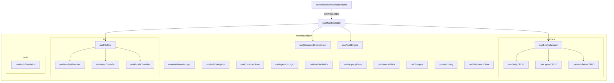

# OMEGA Hook Architecture

> **Directory**: `src/hooks`
> **Status**: INDUSTRIALIZED (Era 7.2.3 Standards)

## 1. Architectural Map (Mermaid)

## 2. Hook Responsibility & Modularization

### 2.1 Core Orchestrators
- **useManifestEditor**: The top-level hook that synchronizes state, I/O, and business logic.
- **useDocumentOrchestrator**: Manages the atomic state of multiple `.acemm` documents, handling persistence, hashing, and isolation.

### 2.2 Specialized Feature Hooks
- **useAuditEngine / useAudit**: Handles real-time validation and cryptographic fingerprinting.
- **useEntityManager**: High-level proxy for manipulating manifest entities (knobs, ports, containers).
- **useFileOps**: Orchestrates complex file system operations (Uploads, Exports, Previews).
- **useSourceEditor**: Provides logic for the YAML/JSON raw source editor.
- **useViewport**: Manages the 2D/3D canvas coordinates and zoom levels.
- **useWorkbenchState**: Manages the workspace layout, tab orchestration, and visual session state.

### 2.3 Modular Sub-Hooks
- **entities/**: Specific CRUD operations for controls, jacks, and layout containers.
- **io/**: Low-level data transfer logic, including YAML normalization and bundle packaging.
- **rack/**: Physics and layout simulation logic for the modular rack.

## 3. Governance Rules
- **Aseptic Composition**: Hooks should be composed from smaller, single-responsibility hooks (e.g., `useManifestEditor`).
- **Multi-Document Isolation**: Use `useDocumentOrchestrator` as the single source of truth for all working documents.
- **Side Effects**: Heavy side effects (File I/O, Integrity checks) must be encapsulated in their respective hooks.
