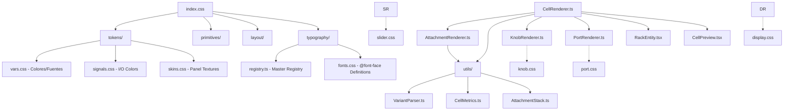

# OMEGA UI Core — Architecture Map (Era 7.2.3)

> [!IMPORTANT]
> **SOURCE OF TRUTH & GOVERNANCE**
> This directory (`abd-ia_synths/src/omega-ui-core`) is the **Absolute Source of Truth** for the OMEGA UI Ecosystem. 
> All changes to renderers, tokens, layout logic, and typography MUST be performed here. 
> The `ABDOmega/ui/omega-ui-core` directory is a **read-only replica** synchronized via:
> `robocopy "d:\desarrollos\ABDSynthsWeb\abd-ia_synths\src\omega-ui-core" "d:\desarrollos\ABDOmega\ui\omega-ui-core" /MIR /FFT /Z /XA:H /W:5 /R:5`

> **Status**: INDUSTRIALIZED (SYS_READY)
> **Role**: Stateless Rendering Engine & Design System
> **Standard**: OMEGA-VPC-1.1 (Visual Parity Contract)

## 1. System Overview (Mermaid)

## 2. Directory Structure

### 2.1 `renderers/` (TypeScript)
Funciones puras (stateless) que generan cadenas HTML de alta fidelidad.
- **CellRenderer**: Orquestador principal. Delega el parseo y métricas a `utils/` para mantener una lógica de despacho limpia.
- **AttachmentRenderer**: Gestiona etiquetas orbitales, LEDs y steppers.
- **utils/**: Capa de lógica compartida.
    - **VariantParser**: Extrae tamaño y color de las variantes industriales.
    - **CellMetrics**: Mapa de radios y dimensiones físicas.
    - **AttachmentStack**: Orquestación de posicionamiento para accesorios orbitales.
- **Primitive Renderers**: Lógica especializada para cada tipo de control industrial.

### 2.2 `tokens/` (CSS)
The Single Source of Truth for visual constants.
- **vars.css**: Unified color palette (`--wb-primary`, `--wb-accent`).
- **skins.css**: Texture definitions (Carbon, Glass, Industrial) using CSS Gradients (No PNGs).

### 2.3 `primitives/` (CSS)
Component-specific styles. Pure CSS, no Tailwind.
- Uses the `{SIZE}_{COLOR}` naming convention (e.g., `.knob-container.size-B.color-cyan`).

### 2.4 `typography/` (Registry & CSS)
The Single Source of Truth for the typographic identity of the system.
- **registry.ts**: Definitions of official fonts, categories, and theme defaults.
- **fonts.css**: Global font injections for offline-first operation.

### 2.5 `layout/` (CSS)
Architectural frame styles.
- **cells.css**: Grid positioning and attachment stack containers.
- **screws.css**: High-fidelity industrial screws.

## 3. Industrial Standards
- **Parity**: Any HTML generated here MUST render identically in the production engine (C++).
- **Scale**: All offsets and dimensions are multiplied by **1.5x** for high-DPI visual comfort.
- **Aseptic**: No React dependencies. Portability is key.

## 4. Legacy Archive
- **DEPRECATED**: `_legacy/primitives/` in the tool folder contains the old React components that have been replaced by this aseptic engine.
