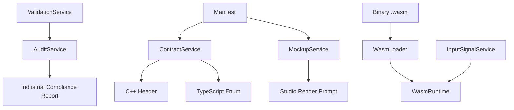

# OMEGA Services Architecture (Era 7.2.3)

> **Status**: INDUSTRIALIZED
> **Standard**: OMEGA-SERVICE-CORE-7.2.3

## 1. Functional Map (Mermaid)

## 2. Service Definitions

### 2.1 Integrity & Governance
- **ValidationService**: Single source of truth for Era 7.2.3 rules. Validates schemas and industrial constraints.
- **AuditService**: Aggregates validation issues and calculates the "Industrial Score".

### 2.2 Technical Integration
- **ContractService**: Translates the visual manifest into technical authority (enums/headers) for the C++ engine.
- **WasmLoader**: Extracts technical contracts directly from self-descriptive WASM modules.

### 2.3 Live Simulation
- **WasmRuntime**: Bridge for real-time DSP simulation.
- **InputSignalService**: Generates virtual LFOs and signal flows for the editor's live mode.

### 2.4 Creative Automation
- **MockupService**: Generates high-fidelity prompts for photorealistic AI module renders.
