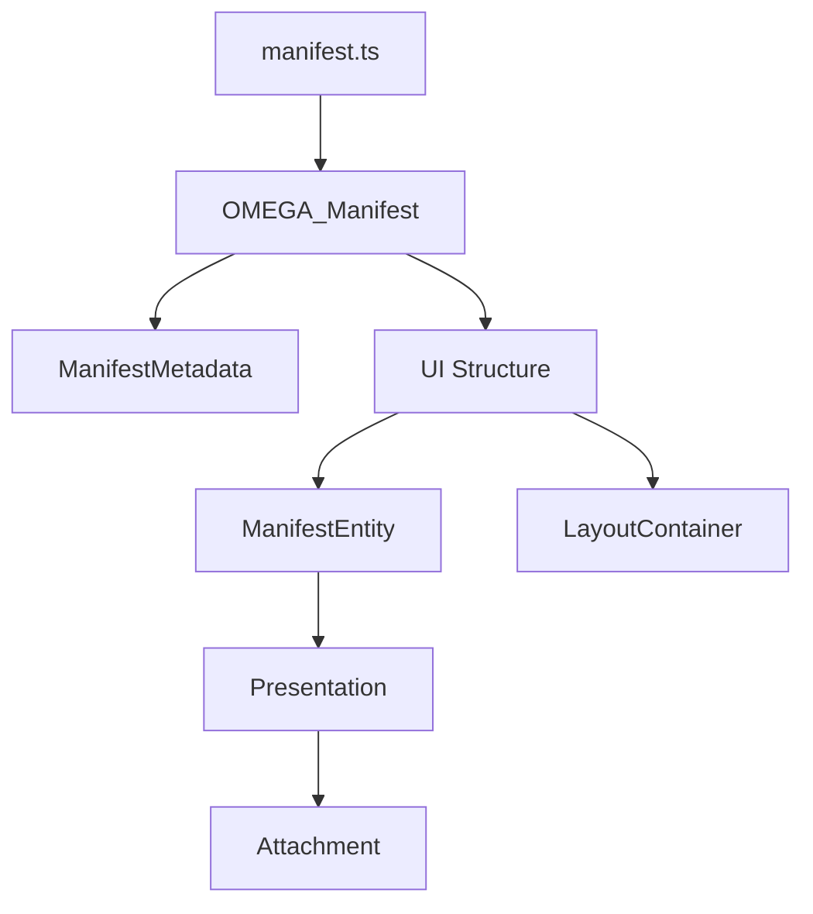

# OMEGA Types Architecture (Era 7.2.3)

> **Status**: INDUSTRIALIZED
> **Standard**: OMEGA-CORE-7.2.3

## 1. Relational Map (Mermaid)

## 2. Core Definitions

### 2.1 OMEGA_Manifest
The root contract. Contains metadata, UI layout (controls/jacks/containers), resources (wasm/contract), and modulation routings.

### 2.2 ManifestEntity
Represents a physical control or signal port. Includes logical binding (`bind`) and visual presentation.

### 2.3 LayoutContainer
Defines the architectural frames (panels, headers, sections) that group entities within the rack.

### 2.4 Presentation
Detailed visual spec: component type, variant, offsets, and orbital attachments.
